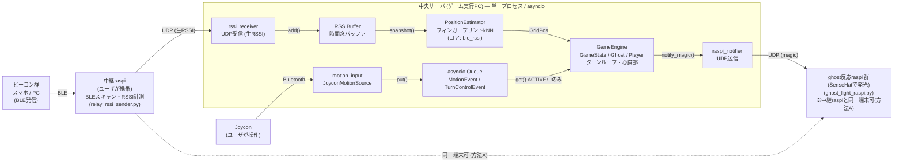
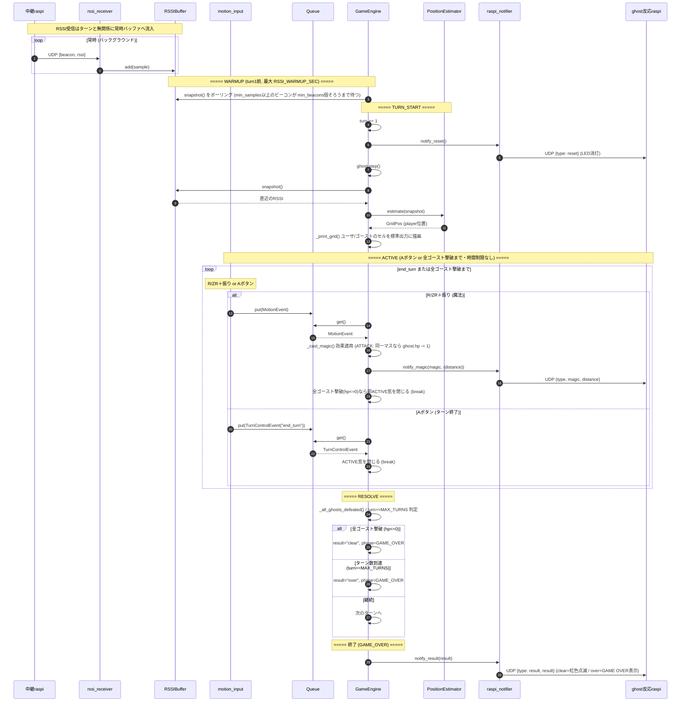
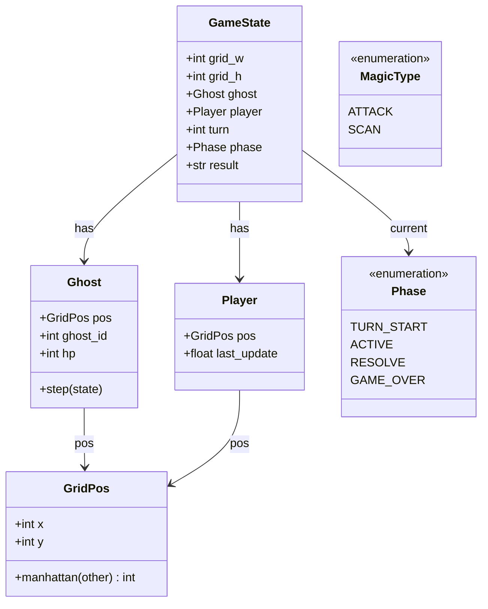

# アーキテクチャ — モンスター探しゲーム 中央サーバ

各ファイル（コンポーネント）の役割と、コンポーネント間でどんな通信をしているかをまとめる。
全体像は `README.md`、本書はその詳細版。図はすべて Mermaid（GitHub / VS Code / 対応ビューアで描画）。

---

## 1. 全体構成図

外部デバイスと中央サーバ内部のモジュール、およびそれらの通信経路を示す。
`★` のついたモジュールはスケルトン（中身は担当者が実装）。

> BLEスキャン・RSSI計測は**中継raspi（ユーザが携帯）だけ**が行い、生RSSIを UDP でゲームPCへ送る。
> **ゲームPCはBLEを自分でスキャンしない**（自分の位置でのRSSIを参照しない）。位置推定（kNN）は
> PC側で、raspi が測ったRSSIだけを使って `PositionEstimator` が行う。
>
> **方法A**: 中継raspi と ghost反応raspi は同一端末にできる（破線）。1台のPiが「RSSI送信(PC:9000宛, outbound)」と
> 「通知受信(自身:9101, inbound)」を別ポート・別方向で同時に担う。ゲームPCは唯一の writer のまま。

ポイント:

- **入力（RSSI / モーション）は常駐プロデューサ**。`RSSIBuffer` と `asyncio.Queue` に積むだけ。
- **`GameEngine` が唯一のコンシューマ兼 state の所有者（single writer）**。状態にロック不要。
- 位置推定の流れ（`Buf → Est → Eng`）は、実際には `GameEngine` がターン開始時に
  `buffer.snapshot()` → `estimator.estimate(snapshot)` の順で呼び出して取得する（オーケストレーションはエンジン側）。
- **中継raspi と ghost反応raspi は同一端末にできる（方法A）**。同じPiが RSSI送信と通知受信を兼ねる。
  ゲームPCの一元管理（single writer）は変わらない。

---

## 2. コンポーネント（ファイル）の役割

### `domain.py` — ドメインモデル（担当A）
ネットワークやデバイスに依存しない純粋なゲームの「データ」。

- `GridPos` … 2Dグリッド座標。`manhattan()` で距離計算。
- `Ghost` … ゴースト。位置 `pos` と体力 `hp`（既定 1。ATTACKで減り、`hp<=0`＋同一マスで捕獲）、`ghost_id` を持つ。`step(state)` で移動（スケルトン: ランダムウォーク）。
- `Player` … プレイヤー。位置推定の結果 `pos` が入る。
- `GameState` … 盤面全体（グリッドサイズ、ゴースト、プレイヤー、ターン数、フェーズ、終了理由 `result`="clear"/"over"/None）。
- `Phase`（enum）… `TURN_START` / `ACTIVE` / `RESOLVE` / `GAME_OVER`。
- `MagicType`（enum）… `ATTACK` / `SCAN`。

**通信**: なし（純データ）。`GameEngine` からのみ読み書きされる。

### `engine.py` — ゲームエンジン（担当A）
中央サーバの心臓部。`GameState` の唯一の書き手。ターンループを回し、入力を消費し、魔法を解決する。

- ターン進行 `_turn_start` / `_turn_active` / `_turn_resolve`（詳細は §4）。
- `_print_grid()` … `_turn_start` の推定後に、現在のグリッド（`grid_w × grid_h`）へ推定ユーザセル `[U]`・ゴーストセル `[G]`（重なると `[*]`）とゴーストの `hp`、ステータス行（現在/最大ターン・残りターン・ATTACK/SCAN残り回数）を標準出力へ描画（デバッグ・動作確認用）。
- `_cast_magic()` … 使用回数上限（`ATTACK_LIMIT` / `SCAN_LIMIT`、各既定10）を確認し、上限内なら効果適用（`_resolve_attack` / `_resolve_scan`）＋ raspi 通知。上限到達後は不発（効果なし・通知なし）。
- `_resolve_attack()` … プレイヤーの推定セル＝ゴーストのセルなら `ghost.hp -= 1`（同一マスでなければ効果なし）。
- `_all_ghosts_defeated()` … 全ゴーストの `hp<=0` 判定（現状1体）。`_turn_resolve` で真ならクリア。
- `_turn_resolve()` … 全ゴースト撃破→`result="clear"`、`turn >= max_turns`(`MAX_TURNS`)→`result="over"`。いずれも `phase=GAME_OVER`。
- `_warmup()` … `run()` の最初、turn1 開始前に**RSSIバッファが十分たまるまで**最大 `RSSI_WARMUP_SEC` 秒待つ。「時間窓内のサンプルが `RSSI_WARMUP_MIN_SAMPLES` 件以上あるビーコン」が `KNN_MIN_VALID` 個そろうまで待ってから turn1 に入る（`_ready_beacon_count()` で判定）。時間切れなら未充足のまま開始。
- `run()` … `_warmup()` 後にターンループ。`result` に応じて `GAME CLEAR` / `GAME OVER` を出力して終了。
- `_drain_queue()` … ACTIVE 突入時にターン外で溜まった古い入力を破棄。

ゲームルール値（`max_turns` / `attack_limit` / `scan_limit`）は `__init__` で必須引数として受け取り、`main.py` が `config.py` から注入する（デフォルト引数は持たせない方針）。

**通信**: `RSSIBuffer.snapshot()` と `PositionEstimator.estimate()` を呼ぶ（同期）／
`asyncio.Queue` から `MotionEvent` を取り出す（ACTIVE 中のみ、非同期 await）／
`RaspiNotifier.notify_magic()` を呼ぶ（同期）。すべてプロセス内。

### `position.py` — RSSIバッファ + 位置推定（担当B）
- `RSSIBuffer`（実装済み）… ビーコンごとに直近の RSSI を時間窓（`RSSI_WINDOW_SEC`）で保持。
  受信スレッドと推定が別スレッドから触れるよう `Lock` で保護。`add()` で追加、`snapshot()` で取得。
- `PositionEstimator`（**フィンガープリントkNNで実装済み**）… `estimate(snapshot) -> Optional[GridPos]`。
  `ble_rssi.snapshot_to_obs()` で snapshot をビーコン別平均RSSI（obs）に畳み、`ble_rssi.estimate_position_knn()`
  で fingerprint CSV の全サンプルと RMSE 比較 → 上位 k ラベルの多数決 → `Gn` を `GridPos(x=col, y=row)` に変換。
  fingerprint CSV が無い/読めない場合は `None`（player は更新されない）。kNNコアは `ble_rssi.py`。

**通信**: `rssi_receiver` から `add()` で書き込まれ（中継raspi計測の生RSSI）、`GameEngine` から
`snapshot()` / `estimate()` で読まれる（プロセス内）。

### `ble_rssi.py` — PC側kNN推定コア（担当B）
単独ツール 2 本（`collect_phone_uuid_fingerprint.py` / `realtime_phone_uuid_grid_estimator_ghost.py`）の
うち**fingerprint読込・kNN推定**部分だけを**原型のまま**取り込み、PC側の `PositionEstimator` に接続したモジュール。
BLEスキャンは raspi 側で行うため、**PC側のこのモジュールはスキャン処理（`bleak`依存）を持たない**。

- `load_fingerprint_samples` … fingerprint CSV の全サンプルを読み込む。
- `rmse_between` / `estimate_position_knn` … 共通ビーコンのRMSEで上位kラベル多数決。
- `snapshot_to_obs` … `RSSIBuffer.snapshot()` をビーコン別平均RSSI（obs）に畳む薄いアダプタ。
- `TARGETS` / `BEACONS` / `label_to_grid_number` 等 … fingerprintの列名・グリッド変換の対応。

**通信**: なし（純粋な計算）。`PositionEstimator` から関数呼び出しで使われる（プロセス内）。

### `rssi_receiver.py` — RSSI受信 / UDP（担当D）
中継raspi が計測した生RSSI を UDP で受信し、`RSSIBuffer` に積む。受信のみを担当し、位置判定はしない（関心の分離）。
ゲームPC側で BLE を直接スキャンする経路は持たない（RSSIはすべて raspi 計測値）。
送信側は中継raspi上で動く **`relay_rssi_sender.py`**（§2.1）。

- `RSSIReceiverProtocol`（`asyncio.DatagramProtocol`）… `datagram_received` で JSON をパースして `buffer.add()`。壊れたパケットは無視（スケルトン的寛容さ）。
- `start_rssi_receiver()` … UDP 受信エンドポイントを起動。

**通信**: 中継raspi ← **UDP受信**（`{"beacon": "phone1", "rssi": -67}`、常時・高頻度、fire-and-forget）。受信後 `RSSIBuffer.add()`（プロセス内）。

### `motion_input.py` — モーション入力（担当C）
モーション入力を抽象化し、検出した `InputEvent`（`MotionEvent` か `TurnControlEvent`）を
`asyncio.Queue` に流し続ける常駐タスク。

- `MotionSource`（ABC）… `run(out_queue)` インターフェース。
- `JoyconMotionSource`（実装済み）… 右Joy-Con を Bluetooth で読む。ブロッキング読取を `run_in_executor` の別スレッドで行い、`call_soon_threadsafe` でキューへ橋渡し。実装済みの入力は2系統:
  - **R / ZR を押しながら振る → 魔法発動**。上下(Z方向)=`ATTACK`、左右(Y方向)=`SCAN`。1押下につき1回検知（`classify_shake()` で判定、閾値 `SHAKE_THRESHOLD`）。
  - **A ボタン → ターン強制終了**（`TurnControlEvent("end_turn")`、立ち上がりエッジで1回）。
- `MotionEvent` … 検出したモーションと対応する `MagicType`。`TurnControlEvent` … ターン制御信号（現状 `end_turn` のみ）。

**通信**: Joycon ← **Bluetooth**（加速度/ボタン、常時）。検出後 `asyncio.Queue.put()`（スレッド→ループ、スレッド安全）。

### `raspi_notifier.py` — 魔法通知 / リセット通知（担当B）
魔法発動時・ターン開始時に、登録済みの raspi へ UDP で通知する。fire-and-forget の単純送信。

- `RaspiTarget` … 宛先 `(host, port)`。
- `RaspiNotifier.notify_magic(magic, payload)` … `{"type": "magic", "magic": ..., ...}` を全宛先に送信。
- `RaspiNotifier.notify_reset()` … `{"type": "reset"}` を全宛先に送信（`GameEngine._turn_start` が毎ターン呼び、raspiのLEDを消灯させる）。`register()` で宛先追加。
- `RaspiNotifier.notify_result(result)` … `{"type": "result", "result": "clear"|"over"}` を全宛先に送信（`GameEngine.run` が終了時に呼ぶ。clear=虹色点滅 / over=GAME OVER表示の合図）。

受信側は raspi 上で動く **`ghost_light_raspi.py`**（§2.1）。距離に応じて光ったLEDは
次の通知まで保持されるため、ターン開始の `reset` で一旦消灯し「点きっぱなし」を防ぐ。

**通信**: raspi へ **UDP送信**（魔法時 `{"type":"magic","magic","distance"}` / ターン開始時 `{"type":"reset"}` / 終了時 `{"type":"result","result"}`、fire-and-forget）。

> **方法A: 中継raspi と ghost反応raspi の同一化**。`RASPI_TARGETS` の宛先を中継raspi（RSSIを送ってくるPi）の
> 固定IP:9101 にすれば、1台のPiが「RSSI送信(PC:9000宛, outbound)」と「通知受信(自身:9101, inbound)」を
> 同時に担える。別ポート・別方向のため同居可能。ゲームPCは唯一の writer のまま、Piは入出力デバイスに徹する。

### `config.py` — 設定（担当: 共通）
ポート、raspi 宛先、グリッドサイズ（既定 3×3 = G1〜G9）、RSSI 時間窓／バッファ長／ウォームアップ、
モーション入力（`JOYCON_POLL_INTERVAL_SEC` / `SHAKE_THRESHOLD`）、
ゲームルール（`GHOST_HP` / `MAX_TURNS` / `ATTACK_LIMIT` / `SCAN_LIMIT`）、
kNN パラメータ（`FINGERPRINT_CSV` / `KNN_K` / `KNN_MIN_VALID` / `KNN_WEIGHTED_VOTE`）
などの定数を一元管理する。**通信**: なし。

> **設計方針（デフォルト引数の禁止）**: 設定・ハイパパラメータの橋渡しにはデフォルト引数を使わない。
> `RSSIBuffer` / `PositionEstimator` / `GameEngine` / `JoyconMotionSource` /
> `RaspiNotifier` および純関数 `classify_shake` の各引数は**必須**とし、`main.py` が `config.py` の値を
> 明示的に注入する。テストは各テスト固有の値を明示的に渡す（テスト内ヘルパで束ねる）。

### `main.py` — 起動エントリポイント（担当A）
各アダプタを組み立て、常駐プロデューサ（RSSI受信・モーション入力）とコンシューマ（ゲームループ）を
`asyncio` で並行起動する。モーション入力は右Joy-Con実機（`JoyconMotionSource`）で行う。**通信**: 起動時の配線のみ。

---

## 2.1 raspi側スクリプト（中央サーバでない側）

ゲームPC（中央サーバ）の外で動く、入出力デバイス側のスタンドアロン・スクリプト。
採用案では **中継raspi = 生RSSI送信のみ**、推定はすべてPC側で行う。

### `relay_rssi_sender.py` — 中継raspi: 生RSSI送信（採用案の送信側）
中継raspi（ユーザが携帯）がBLEをスキャンし、検出した各ビーコンの生RSSIを UDP でゲームPCへ送るだけ。
位置推定はしない（PC側 `PositionEstimator` が kNN で行う）。

- スキャン/UUID照合（`TARGETS` / iBeaconパース / `find_target`）は `collect_phone_uuid_fingerprint.py` を
  import して**原型のまま再利用**（ビーコン定義を一箇所に保つ）。
- 一定間隔（`--interval`、既定0.2s）で、各ビーコンの最新観測（`--stale-sec` 以内）を送信。
- 起動例: `python3 raspi/relay_rssi_sender.py --server-ip <PCのIP> --server-port 9000`

**通信**: ゲームPC へ **UDP送信** `{"beacon": "phone1", "rssi": -67}`（→ `rssi_receiver`、#2）。

### `ghost_sensehat.py` — ゴースト距離→SenseHat発光ロジック（表示ライブラリ）
`realtime_phone_uuid_grid_estimator_ghost.py` のSenseHatフィードバック部分を、距離(int)入力の
純関数群として切り出したモジュール。BLE推定・ネットワークに依存しない（発光の対応だけを担う）。

- `init_sensehat(no_sensehat)` … LED初期化。ライブラリ/実機が無ければ `None`。
- `distance_to_state(distance)` … 距離→状態名。`0:rainbow / 1:red / 2:green / 3:blue / それ以上・None:off`。
- `rainbow_pixels()` / `render_state()` / `update_sensehat_feedback(sense, distance, last_state)` … 状態を描画（同一状態なら再描画しない）。

**通信**: なし（純粋な表示計算）。`ghost_light_raspi.py` から関数呼び出しで使われる。

### `ghost_light_raspi.py` — ゴースト反応ライト（raspi: 単独実行）
ゲームPCの `raspi_notifier` が送る通知の `distance` を UDP で受信し、`ghost_sensehat` で
SenseHat を光らせる（ゴーストに近いほど派手）。`distance` を持つパケットで発光を更新し、
欠落・壊れたパケットは消灯/無視。`{"type": "reset"}` 受信でLEDを消灯し `last_state` を初期化する。
`{"type": "result", "result": ...}` 受信で終了演出を行う（`clear`=虹色点滅 `ghost_sensehat.blink` /
`over`="GAME OVER"スクロール表示 `ghost_sensehat.show_message`）。演出パラメータ（点滅回数・色など）は
`server/config.py` の定数（`CLEAR_BLINK_*` / `GAMEOVER_*`）で調整する（このスクリプトが
`sys.path` 経由で `config` を import して `blink()` / `show_message()` へ明示的に渡す）。

- 起動例: `python3 raspi/ghost_light_raspi.py --port 9101`
- distance を届けるには `config.RASPI_TARGETS` にこのraspiの `(<ip>, 9101)` を追加する
  （`notify_magic` は全宛先へ distance 付きで送るため、SCAN時に距離が届く）。

**通信**: ゲームPC ← **UDP受信**（`raspi_notifier` から、#9 と同じ通知を別ポートで受ける）。

> **方法A**: 1台のPiで `relay_rssi_sender.py`（→PC:9000 outbound）/
> `ghost_light_raspi.py`（自身:9101 inbound）を
> 並行起動できる。別ポート・別方向のため同居可能。

---

## 3. 通信マトリクス

「誰が誰に・どの経路で・何を・いつ」を一覧化する。

| # | From → To | 経路 | ペイロード | タイミング | 同期/非同期 |
|---|---|---|---|---|---|
| 1 | ビーコン群 → 中継raspi | BLE アドバタイズ | （raspiがRSSIとして計測） | 常時 | — |
| 2 | 中継raspi（`relay_rssi_sender.py`） → `rssi_receiver` | **UDP**（ネットワーク, AP経由） | `{"beacon": "phone1", "rssi": -67}`（raspi計測の生RSSI） | 常時・高頻度 | 非同期 / ロスト許容 |
| 3 | `rssi_receiver` → `RSSIBuffer` | 関数呼び出し `add()` | `RSSISample(beacon_id, rssi, ts)` | 受信ごと | 同期（プロセス内） |
| 4 | `RSSIBuffer` → `PositionEstimator` | `snapshot()` → `estimate()`（kNN、エンジン経由） | `dict[beacon, list[RSSISample]]` → `GridPos` | ターン開始時 | 同期（プロセス内） |
| 5 | Joycon → `motion_input` | **Bluetooth**（HID） | 加速度 / ボタン入力 | 常時 | ブロッキング読取を別スレッド化 |
| 6 | `motion_input` → `asyncio.Queue` | `put()`（`call_soon_threadsafe`） | `MotionEvent(magic)`（R/ZR＋振り）/ `TurnControlEvent("end_turn")`（Aボタン） | 検出ごと | スレッド安全 |
| 7 | `asyncio.Queue` → `GameEngine` | `get()` | `MotionEvent` / `TurnControlEvent` | **ACTIVE フェーズ中のみ** | 非同期 await |
| 8 | `GameEngine` → `raspi_notifier` | 関数呼び出し `notify_magic()` / `notify_reset()` / `notify_result()` | `MagicType` + `{"distance": n}` / リセット / 終了結果 | 魔法発動時 / ターン開始時 / ゲーム終了時 | 同期（プロセス内） |
| 9 | `raspi_notifier` → ghost反応raspi（`ghost_light_raspi.py`） | **UDP**（宛先 `RASPI_TARGETS`） | `{"type": "magic", "magic": "ATTACK", "distance": 3}` / `{"type": "reset"}` / `{"type": "result", "result": "clear"}` | 魔法発動時 / ターン開始時 / ゲーム終了時 | 非同期 / fire-and-forget |

> 中央サーバ（ゲームPC）の外部との通信は **#2（RSSI受信, UDP）/ #5（モーション, Bluetooth）/
> #9（魔法通知, UDP）** の 3 つ。BLEスキャン（#1）は中継raspi側で完結し、PCはBLEを直接見ない。
> 残りはすべて中央サーバのプロセス内通信（関数呼び出し・バッファ・キュー）。
>
> **方法A**: #2 の送信元（中継raspi）と #9 の宛先（ghost反応raspi）を同一端末にできる。`RASPI_TARGETS` を
> その中継raspiの固定IP:9101 にすればよい。#2 は raspi→PC(9000)、#9 は PC→raspi(9101) で別ポート・別方向。

---

## 4. 1ターンのシーケンス図

RSSI 受信はターンと無関係にバックグラウンドで常時バッファへ流入し続ける点に注意。
ゲームエンジンは ACTIVE フェーズの間だけモーションを魔法として作用させる。

---

## 5. 並行性モデル（asyncio）

中央サーバは **1 プロセス・単一イベントループ**で動く。`main.py` が次を並行起動する。

- **RSSI 受信エンドポイント**（`create_datagram_endpoint`）… 中継raspiからの生RSSI(UDP)をループ内で受信。
- **モーション入力タスク**（`MotionSource.run`）… ジェスチャを検出してキューへ。
- **ゲームループタスク**（`GameEngine.run`）… ターンを回す唯一のコンシューマ。

設計上の効きどころ:

- **`GameState` は単一スレッド（ループ）からのみ書き換わる** → ロック不要・競合なし。
- **ブロッキングなデバイス読取（joycon）だけ別スレッド**に逃がし、`call_soon_threadsafe` で
  安全にキューへ渡す。ループ本体はブロックしない。
- **`RSSIBuffer` のみ `Lock` を持つ**。受信や推定をループ外スレッド（executor）で行う可能性に備えた防御。

---

## 6. ドメインモデル（クラス図）

---

## 7. 拡張余地（通信の観点）

- **位置推定の高度化**: 現状はフィンガープリントkNN（`ble_rssi`）。#4 の `estimate()` 内部のみ変更すれば
  三辺測位／学習モデルにも差し替え可能。入出力の型（`snapshot` → `GridPos`）を保てば他に影響しない。
- **モーション入力の差し替え**: `MotionSource` を実装すれば joycon / SenseHat / ネットワーク経由 のいずれにも対応（#5・#6 のみ変更）。
- **RSSI 経路の変更**: UDP を MQTT/TCP に変える場合も `rssi_receiver`（#2）だけ差し替え。
- **中継raspi と ghost反応raspi の同一化（方法A）**: `RASPI_TARGETS` を中継raspiの固定IP:9101 にするだけ。
  1台のPiが RSSI送信(#2)と通知受信(#9)を兼ねる。別ポート・別方向のため同居でき、PC側コードの変更は不要。
- **ゴースト・魔法の拡張**: `Ghost` / `MagicType` を拡張。通信経路は不変。
